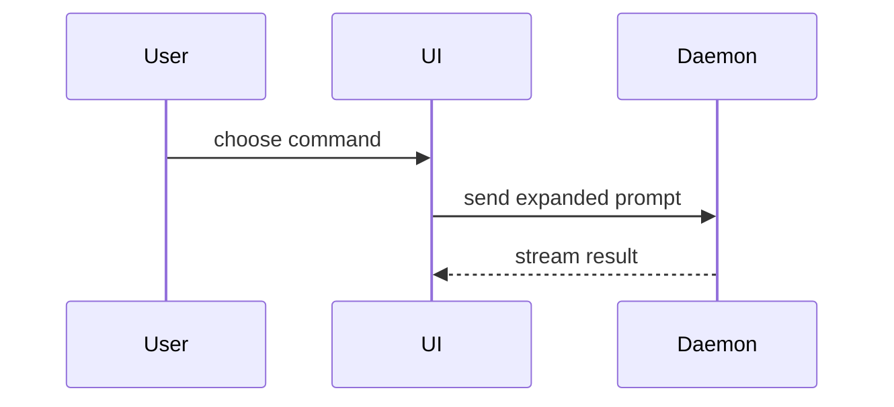

## Codex执行与回流约定

加载、子代理及结果格式遵循 [统一执行协议](../develop-system/references/codex-runtime.md)。在显式 develop-system 流程内，本技能负责自己的专业工作与完成判断；所有结束状态先返回 develop-system 登记，再由它恢复父技能或调度下一工作。总路由只核对协议、版本和依赖，不代做实现、测试、评审或验收。流程外按本技能独立执行并返回调用方。

正文的 Skill 工具及 `/skill` 写法，在 Codex 中按真实路径读取对应 SKILL.md。嵌套专业工作登记子帧，结果先回流总路由。委派有授权和可用工具时使用真实子代理，否则切换到专业技能顺序执行；仅修改技能文件不启动子代理。分支、提交、远程工单和 PR 操作遵守用户授权与实际仓库条件，不假定已获发布或外部写入授权。

本技能编写包含行为变化、验证证据和风险的 PR 描述。只有请求包含创建/更新 PR 或已有授权时才写入远程；创建后按 Codex 宿主要求附加 PR。描述完成不等于提交、合并或发布完成。

Use this template for writing the PR body:

```markdown
## Summary

<diagram, diff-sketch, or tree>

## Evidence

- **Before:** <screenshot/output/failing test run>
  **After:** <screenshot/output/passing test run>

## Merge Danger

**Door:** <one-way or two-way>

<optional: description>

**Blast Radius:** <one-word description>

<optional: potential ramifications of merge>
```

## Sections

Skip all preambles and keep prose brief. Use the user's domain language from `GLOSSARY.md`.

### Summary

Pick the smallest view that makes the key point clear.

- Show logic or an algorithm as pseudocode:

```text
on(save)
  if content is unchanged
    return cached result
  write new content
  return fresh result
```

- Show runtime control flow as a call tree:

```text
submitForm
  createSession
    persistPrompt
    launchAgent
  navigateToSession
```

- Show UI structure as a component tree, including state and module boundaries that matter:

```text
<SessionPage> (apps/example/src/routes/session.tsx)
  useSessionEvents()
  <SessionToolbar>
    <RunSkillButton> (packages/ui)
```

- Show file responsibility or a broad refactor as a shallow file tree:

```text
src/
├── commands/       # parses user actions
├── sessions/       # owns session state
└── transport/      # sends API requests
```

- Show component interaction, control flow, or data flow with Mermaid:



- Use `diff` when the point is what changes and the surrounding shape already exists. Match the diff shape to the topic.

For a component change:

```diff
 <SessionPage>
   useSessionEvents()
   <SessionToolbar>
+    <RunSkillButton />
   <SessionTimeline>
+    <SkillResultCard />
```

For a file-layout change:

```diff
 src/
 ├── commands/
+│   └── show-me.ts       # expands the slash command
 ├── sessions/
-└── transport.ts
+└── transport/
+    ├── client.ts
+    └── stream.ts
```

For a call-tree or call-stack change:

```diff
 submitForm
   createSession
     persistPrompt
+    expandSkillMention
     launchAgent
-  navigateToSession
+  navigateToSession
+    subscribeToEvents
```

For a state or control-flow change:

```diff
 on(save)
-  write content
+  if content is unchanged
+    return cached result
+  write new content
+  invalidate cache
```

- Show the whole block when most of it is new, when omitted context would hide ownership or order, or when the user needs a copyable target shape:

```ts
function expandSkill(command: string): string {
  const skillName = command.slice(1);
  return `use the ${skillName} skill`;
}
```

#### Guidance

Place each visual next to the short text it supports. Keep only the calls, files, props, states, and boundaries needed to answer the user's current question or the options to resolve the current discussion point.

You may use one of these, you may use several, it is unlikely you will use all of them. Use your judgement and don't overwhelm the user.

### Evidence

Concrete evidence that the change works. Show a before and after.

Screenshots are S-tier - when the environment is set up for it and the change is visual.

Execution-based evidence is A-tier. Test results, console output. Show the exact test that now fails and passes, using pseudocode.

### Merge Danger

Describe whether it's a one-way or two-way door. You can walk back through two-way doors, but not one-way doors. A PR that is cheap to roll back is lower risk. Changes that involve destructive actions or hard-to-reverse decisions are one-way doors.

The blast radius is the potential impact or scope of the changes introduced by this PR. Consider all possibilities. Examples are layout shift, breakages for consumers, mobile responsiveness, etc.
